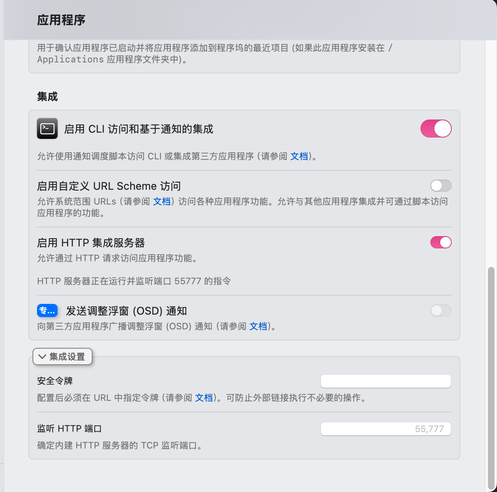

# HASS Better Display

HASS Better Display 是一个用于 Home Assistant 的集成，旨在提供对显示器的控制功能。该集成允许用户通过 Home Assistant 界面轻松管理显示器的亮度、音量和输入源。

## 特性

- **亮度控制**：可以通过 Home Assistant 调整显示器的亮度。
- **音量控制**：支持音量的调节，用户可以方便地设置显示器的音量。
- **输入源切换**：用户可以在多个输入源之间切换，例如 HDMI 和 DP。
- **易于配置**：通过简单的配置流程，用户可以快速设置集成。

## 安装

1. 使用 HACS 安装

2. 重启 Home Assistant。

## 配置

首先，确保你的mac已经安装了betterdisplay，并且打开http集成服务器。

  

在 Home Assistant 中，通过 UI 进行配置。配置项包括：

- `device_name`：显示器的名称。（需要与betterdisplay的name一致）
- `base_url`：显示器的 API 基础 URL。（你的mac的ip地址）
- `source_list`：输入源列表，格式为 `key:value`，例如 `hdmi1:14,hdmi2:15,dp:16`。（key可以使用你想使用的任意名，value必须为对应的ddc的inputSelect code）

## 使用

一旦集成成功，用户可以在 Home Assistant 的仪表板上找到控制显示器的选项。用户可以通过简单的点击来调整亮度、音量和切换输入源。

## 贡献

欢迎任何形式的贡献！如果你有建议或发现了问题，请在 GitHub 上提交问题或拉取请求。

## 许可证

本项目采用 MIT 许可证，详情请参阅 [LICENSE](LICENSE) 文件。

## 联系

如需更多信息，请访问 [GitHub 页面](https://github.com/shelken/hass-better-display)